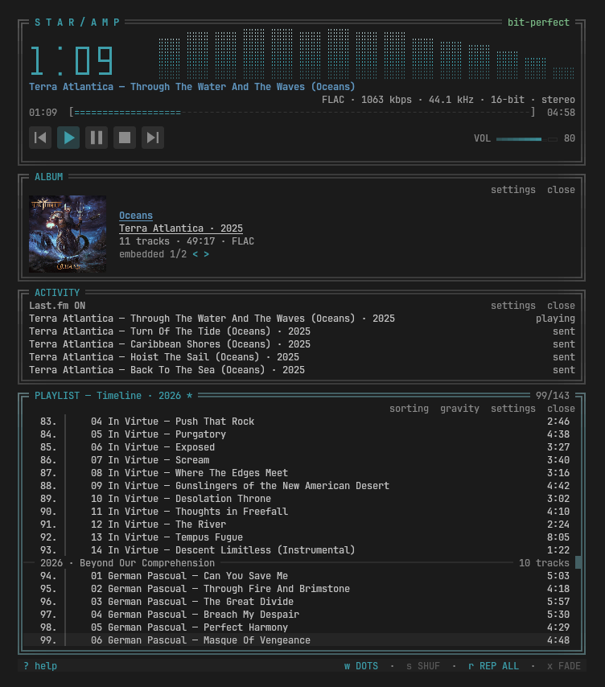

# star/amp

[](https://github.com/bstar/staramp/actions/workflows/nix.yml)
[](https://github.com/bstar/staramp/actions/workflows/debian.yml)
[](https://github.com/bstar/staramp/actions/workflows/arch.yml)
[](LICENSE)

A terminal player for a more civilized age.

No streaming. No radio stations. No account required. WinAmp inspired. It plays
the files on your disk, and it plays _all_ of them.

[](docs/screenshot.png)

## Get it

Built packages for the current release are on the
[releases page](https://github.com/bstar/staramp/releases/latest).

|                          |                                                        |
| ------------------------ | ------------------------------------------------------ |
| **AppImage**             | one file, no install, runs on any desktop Linux        |
| **`.deb`**               | Debian and Ubuntu                                      |
| **Arch**                 | `packaging/PKGBUILD`                                   |
| **Nix**                  | `nix run github:bstar/staramp`                  |
| **macOS**                | Apple Silicon, via Nix or Homebrew                     |
| **Remote**               | `staramp remote <host>` — a library over SSH            |
| **Source**               | a Rust toolchain and a few development packages        |

Every one of them is set out in [Installing](#installing) below, along with
what each needs on the machine.

## Point it at your music

There is no default music directory, on purpose: on the machine star/amp was
built on the music is a removable disk, and a player that guesses wrong is
worse than one that asks. Two commands and it plays.

```sh
staramp scan ~/Music     # index it, once
staramp                  # play
```

`scan` remembers the directory you hand it, so you only pass it the once.
Everything after that reads the index.

If you would rather write it down, the setting lives in
`~/.local/staramp/config.toml`, which is created with comments the first time
star/amp runs:

```toml
library_root = "/mnt/music"
```

To try it on one folder without indexing anything at all, open the folder
directly. No config, no index, no scan:

```sh
staramp ui "/path/to/an/album"
staramp ui some-playlist.m3u
```

Scanning is resumable and incremental. The reference library, 34,000 files
across 1.1 TB, takes 458 seconds cold and 1.1 seconds on every run after that,
because a rescan only looks at what changed.

## Why

I absolutely love terminal music players, but none of them really do what I
want. I needed something incredibly easy to use, hides really powerful features
and looks great. Star/amp is an attempt to be the ultimate player for people
with local music collections. It was built against a real one: 1.1 TB and about
22,000 files, which is enough to break most players in the same three places.

- **Formats.** Monkey's Audio, WavPack, Musepack and DSD are common in
  lossless collections and are missing from nearly every pure-Rust or pure-Go
  player. star/amp decodes the mainstream formats natively with
  [symphonia](https://github.com/pdeljanov/Symphonia) and links
  libavformat/libavcodec **in-process** for everything else. Not a subprocess:
  real seeking, no respawn, no `ffmpeg` on `PATH` at runtime.
- **CUE sheets.** Single-file album rips with a `.cue` are the norm for EAC and
  vinyl rips. In the reference library, **27% of curated playlist entries** are
  cue virtual tracks. star/amp treats them as first-class, reads and writes
  MPD's `Album/rip.cue/track0007` URI form, and plays a cue album as one linear
  read of one file, which is both perfectly gapless and the fastest access
  pattern there is.
- **Scale.** A player that walks the filesystem on every refresh cannot work at
  this size. star/amp keeps a SQLite index with resumable scans, mtime and size
  change detection, and a file watcher that survives the disk being unplugged.

### The numbers quoted here

They come from one library, and three different true counts of it get used
below, so they are worth separating once:

|              |                                                                 |
| ------------ | --------------------------------------------------------------- |
| ~22,000      | audio files on disk                                             |
| 31,928       | addressable tracks, once cue sheets are expanded                |
| 34,071       | files a scan looks at, counting sheets, images and side-cars    |

## Status

Usable. Every format in the reference library plays, the index and playlists
work against real data, and the player runs.

|                      |                                                                                                       |
| -------------------- | ----------------------------------------------------------------------------------------------------- |
| Decoding             | **done**: 9 of 9 formats, 7 of them bit-identical to ffmpeg                                            |
| Audio output         | **done**: bit-perfect at 44.1/96/192 kHz, zero underruns                                              |
| CUE sheets           | **done**: 1,054 of 1,124 sheets, 10,840 virtual tracks                                                |
| Library index        | **done**: 34k files, 458 s cold, 1.1 s warm                                                           |
| Playlists & queue    | **done**: 29 MPD playlists resolve at 96.7%; unresolved lines survive a rewrite untouched             |
| TUI                  | **done**: docked Winamp windows, themes, keymap, mouse                                                |
| Winamp `.wsz` import | **done**: ramp verified exact against VISCOLOR.TXT                                                    |
| MPRIS + IPC          | **done**: `playerctl -p staramp`, `staramp ctl`                                                       |
| Packaging            | **done**: Nix flake and home-manager module, PKGBUILD, `.deb`, AppImage, portable tarball, CI         |
| Text effects         | **done**: audio-reactive, and switchable off                                                          |
| Visualizer           | **done**: seven modes plus off, cycled with `w` and `W`                                               |
| Session resume       | **done**: offers to pick up where you left off                                                        |
| Album art            | **done**: embedded, folder, `Covers/`, and the Cover Art Archive; kitty graphics where there are any  |
| Equalizer            | **done**: 10 bands, presets, live                                                                     |
| ReplayGain           | **partial**: tags are read and applied; no EBU R128 scanner yet, so 31,700 tracks carry no gain to use |
| Smart playlists      | **partial**: the query language and its SQL compiler work from the CLI; no rule builder in the TUI    |
| Listening history    | **done**: permanent local plays/skips, available to smart playlists                                    |
| Scrobbling           | **done**: independent Last.fm and ListenBrainz accounts, now-playing and durable retries              |

## Installing

**Nix / NixOS**

```sh
nix run github:bstar/staramp
```

Declaratively, with the home-manager module:

```nix
{
  inputs.staramp.url = "github:bstar/staramp";

  # in your home-manager config:
  imports = [ inputs.staramp.homeManagerModules.staramp ];
  programs.staramp = {
    enable = true;
    libraryRoot = "/mnt/music";
    # Read and write MPD's own playlist directory. star/amp writes the same
    # URI form, so both stay in sync.
    playlistDir = "${config.home.homeDirectory}/.config/mpd/playlists";
    stylix.enable = true;   # derive the theme from your base16 scheme
  };
}
```

**AppImage** the one that needs nothing installed. Download it, make it
executable, run it:

```sh
chmod +x staramp-*-x86_64.AppImage
./staramp-*-x86_64.AppImage
```

It carries its own ffmpeg, which is the whole reason it exists: the libav
sonames differ on every distribution, so a plain binary built against one
refuses to start on the next. It uses the system's ALSA rather than bundling
it, because ALSA loads the plugin that reaches PipeWire or PulseAudio from the
host, and a bundled copy would find nothing to play through. Any desktop Linux
already has it.

On a distribution that no longer ships libfuse2, run it as
`./staramp-*.AppImage --appimage-extract-and-run`.

**Arch** with `packaging/PKGBUILD`:

```sh
cd packaging && makepkg -si
```

**Debian / Ubuntu**: a `.deb` per Debian generation is attached to each
release, because the dependency on libavcodec is version specific and one file
cannot serve them all. Take the one matching your release, or build your own:

```sh
sudo apt install pkg-config clang libclang-dev libasound2-dev \
  libavcodec-dev libavformat-dev libavutil-dev libswresample-dev
cargo install cargo-deb && cargo deb
```

The Debian and Arch packages are both built and then installed from clean
containers in CI, so the dependency lists here are the ones that actually work
rather than the ones that ought to.

**Portable tarball**, for distributions without a package:

```sh
tar xf staramp-*-x86_64-linux-gnu.tar.gz
cd staramp-* && ./staramp
```

Needs `alsa-lib`, `ffmpeg` and `dbus` present. It is built against glibc 2.31,
so it runs on Debian 11 and later, Ubuntu 20.04 and later, and RHEL 9 and
later. There is no fully static musl build: ffmpeg's dependency graph does not
cross-compile cleanly under `pkgsStatic`, and the AppImage covers the same
ground properly.

**macOS** on Apple Silicon, either way round. With Nix:

```sh
nix run github:bstar/staramp
```

Or from source with Homebrew, which needs no Nix on the Mac:

```sh
brew install ffmpeg pkg-config
cargo build --release
```

If the build stops in `ffmpeg-sys-next`, it is bindgen looking for libclang.
The active Apple toolchain always carries one, and `xcrun` is what knows where
-- with full Xcode installed it is under `Toolchains/XcodeDefault`, not the
`usr/lib` beside `xcode-select -p`:

```sh
export LIBCLANG_PATH="$(dirname "$(xcrun --find clang)")/../lib"
```

No ALSA and no D-Bus: output goes through CoreAudio, and MPRIS is compiled out
entirely rather than shipped as two megabytes that cannot run. Everything else
is the same program, and a Mac can be either end of a remote library -- the
machine playing, or the machine holding the files.

Intel Macs need the plain `cargo` build above. There is no Nix package for
them, because nixpkgs 26.11 dropped `x86_64-darwin`; a 26.05 nixpkgs still has
it if you would rather stay declarative.

**From source** needs a Rust toolchain (1.90 or newer), `libclang` for
bindgen, and development packages for `alsa-lib` (Linux only) and four ffmpeg libraries:
libavformat, libavcodec, libavutil and libswresample. Not libavfilter,
libavdevice or libswscale. Those are video plumbing, and `ffmpeg-next` is
pinned to the decode and resample features so they are never linked.

```sh
nix develop -c cargo build --release   # or supply those yourself
```

[CONTRIBUTING.md](CONTRIBUTING.md) has the rest, including the one environment
variable (`LIBCLANG_PATH`) that a first build outside Nix usually needs.

## Keys

`?` or `F1` opens this list inside the player, where it is generated from the
same table the keys are dispatched from and so cannot drift from what the
program does.

| Transport      |                                              |
| -------------- | -------------------------------------------- |
| `space` / `c` / `x` | play or pause                           |
| `v`            | stop                                         |
| `z` / `b`      | previous / next track                        |
| `ctrl+up/down` | volume                                       |
| `s`            | shuffle on or off                            |
| `S`            | reshuffle now                                |
| `r`            | repeat off / all / one                       |

| Progress bar    |                            |
| --------------- | -------------------------- |
| `left`/`right`  | seek 5 seconds             |
| `shift+left/right` | seek 30 seconds         |
| `d`             | seek bar style             |

| Playlist        |                               |
| --------------- | ----------------------------- |
| `up`/`k`, `down`/`j` | move                     |
| `pgup` / `pgdn` | page                          |
| `home`/`g`, `end`/`G` | first / last track      |
| `enter`         | play what is selected         |
| `f`             | order the playlist            |
| `/`             | filter the playlist           |
| `alt+up` / `alt+down` | move a whole record up or down |
| `ctrl+s`        | save the playlist             |

| Tagging rows    |                               |
| --------------- | ----------------------------- |
| `t`             | tag this row                  |
| `T`             | clear every tag               |
| `y`             | copy the tagged rows          |
| `u`             | put them here                 |
| `m`             | move them here                |
| `del` / `D`     | remove them                   |

`/` narrows the playlist to the rows that match what you type: every word has
to be found somewhere in the artist, title, album, year or file path, in any
order and any case. `enter` applies it, `esc` keeps whatever was in force, and
`enter` on an empty box clears it. Pressing `/` again opens the box with the
current words in it, so a filter is edited rather than retyped. It works from
any panel and brings the playlist up. The music is not filtered -- a hidden
track still plays when its turn comes -- only what the list shows, and the
title says what it is showing.

Tagging is how a queue gets rearranged in bulk: mark rows anywhere in the list,
including across playlists, then copy, move or delete them in one go. While any
row is tagged the available commands are shown across the top of the player,
where they do not scroll away with the list.

| Library browser |                                |
| --------------- | ------------------------------ |
| `l`             | open the browser (`esc` closes it) |
| `left`/`h`, `right`/`l` | change column          |
| `/`             | search it                      |
| `space`         | add the selection to the queue |
| `a`             | add the whole record           |

| Windows         |                               |
| --------------- | ----------------------------- |
| `p`             | playlist on or off            |
| `i`             | album info on or off          |
| `alt+g`         | equalizer panel on or off     |
| `alt+e`         | choose a playlist             |
| `alt+i`         | choose a cover                |
| `alt+r`         | look the cover up again       |
| `alt+s`         | listening-history panel on or off |
| `alt+1` … `alt+5` | focus player, album, equalizer, playlist, history |
| `tab`           | next pane                     |

| Equalizer, appearance, general |                    |
| ------------------------------ | ------------------ |
| `e`                            | equalizer on or off |
| `[` / `]`                      | previous / next preset |
| `w` / `W`                      | next / previous visualizer |
| `+` / `-`                      | bar width          |
| `alt+t`                        | next theme         |
| `a`                            | animations on or off |
| `esc`                          | close whatever is open |
| `?` / `F1`                     | help               |
| `q`                            | quit               |

`esc` never quits. Terminals encode `alt`+key as escape followed by the key, so
binding `esc` to quit would put every `alt` binding one dropped byte away from
closing the player.

## Mouse

The pointer works everywhere the keyboard does.

| Where     | Gesture                    | Does                            |
| --------- | -------------------------- | ------------------------------- |
| playlist  | wheel                      | scroll the list                 |
| playlist  | click                      | select a track                  |
| playlist  | double click               | play it                         |
| playlist  | click `filter`             | order the playlist              |
| player    | click a transport button   | that button                     |
| player    | click `SHUF` / `REP`       | toggle                          |
| player    | click or drag the bar      | seek                            |
| player    | wheel over the bar         | seek 5 seconds                  |
| player    | click or drag `VOL`        | set the volume                  |
| player    | wheel over `VOL`           | volume by 5%                    |
| player    | click the analyzer         | next visualization              |
| player    | right click anywhere       | play or pause                   |
| equalizer | click `[ON ]`              | enable or bypass                |
| equalizer | click the chevrons         | change preset                   |
| equalizer | click or drag a band       | set its gain                    |
| equalizer | wheel over a band          | 1 dB                            |
| album     | click the cover            | next candidate cover            |
| album     | click `retry`              | look the cover up again         |
| overlays  | click outside              | close the picker                |
| overlays  | click `close` on a header  | close that panel                |
| overlays  | click `settings` on a header | what that panel controls      |

## Theming

`theme = "system"` follows the desktop. star/amp reads Stylix's
`~/.config/stylix/palette.json`, so whatever base16 scheme the rest of the
desktop is set to, the player matches it, analyzer ramp included.

```sh
staramp theme list          # what is available, and what the system is set to
staramp theme show cosmic   # swatches and measured contrast
```

Sixteen themes ship built in: `winamp-classic`, `cosmic`, `catppuccin-mocha`,
`catppuccin-latte`, `gruvbox-dark`, `nord`, `tokyo-night`, `dracula`,
`rose-pine`, `everforest`, `solarized-dark`, `one-dark`, `kanagawa`,
`ayu-dark`, `matte-black`, `terminal`. `alt+t` cycles them live.

Import your own:

```sh
staramp theme import-base16 scheme.yaml   # any base16 scheme
staramp theme import base.wsz             # a classic Winamp skin
```

Every built-in is checked against WCAG AA in the test suite: body text,
selected rows and dim text all have to clear 4.5:1.

## Configuration

`~/.local/staramp/config.toml`, written with comments on first run. The main
knobs:

|                                |                                                                                                  |
| ------------------------------ | ------------------------------------------------------------------------------------------------ |
| `library_root`                 | where the music is. The one setting with no default                                              |
| `playlist_dir`                 | `.m3u` directory, read and written in place                                                      |
| `theme`                        | `"system"` to follow the desktop, or a name                                                      |
| `volume`                       | 0.0 to 1.0                                                                                       |
| `[ui] seek_style`              | how the seek bar is drawn: `ansi` (default), `bar`, `thin`, `blocks`                             |
| `[ui] graphics`                | how covers are drawn: `auto`, `kitty`, `blocks`, `off`. See [Album art](#album-art)              |
| `[ui] buttons`                 | transport buttons: `auto` for pictures where the terminal can, `text` for ASCII. `o` toggles     |
| `[ui] padding_x` / `padding_y` | blank columns and rows around the window                                                         |
| `[ui] show_equalizer`          | show the EQ panel; visibility does not enable or bypass the EQ                                   |
| `[ui] show_scrobbler`          | show listening history; visibility does not enable or disable network scrobbling                 |
| `[art] fetch`                  | look covers up on the Cover Art Archive when the files have none. **Off** unless you turn it on  |
| `[output] mode`                | `"native"` for bit-perfect, `"fixed"` to pin the rate                                            |
| `[cue] pregap`                 | which track a pregap belongs to                                                                  |
| `[vis] mode`                   | `bars` `leds` `peaks` `dots` `wave` `scope` `fluid` `off`                                        |
| `[vis] gain_db`                | shifts the analyzer range if your music sits quiet or loud                                       |
| `[vis] smoothing`              | how long the `fluid` mode's bars take to fall, 0 to 1. Lower snaps to the music                  |
| `[vis] bar_width` / `bar_gap`  | cells per bar, and columns between bars                                                          |
| `[eq] enabled` / `preset`      | 10-band equalizer                                                                                |
| `[replaygain] mode`            | `off` (default), `track`, or `album`. See [ReplayGain](#replaygain)                              |
| `[scrobble] lastfm`            | submit eligible tagged listens to Last.fm; off by default                                       |
| `[scrobble] listenbrainz`      | submit eligible tagged listens to ListenBrainz; off by default                                  |
| `[fx]`                         | track-change effects, including `reduced_motion` to disable them                                 |

Settings changed from inside the player are written back here. The write is a
line edit rather than a re-serialisation, so comments, ordering and any key
star/amp does not know about survive it byte for byte.

## Listening history and scrobbling

Local listening history is always recorded; it does not require an account or
a network connection. A track counts as played when it ends naturally, or once
half of it (up to four minutes) has actually played. Next, previous, stop, or a
seek before that point records a skip. Paused time does not count, and a crash,
decode failure, or quit records an interruption rather than a skip.

The optional network providers are independent and off by default. Their
`[scrobble]` switches keep working when the history panel is hidden; `alt+s`
changes only that panel's visibility. Open it, press `enter`, and choose a
provider's authenticate row. Credentials can be pasted directly into the prompt; Last.fm asks for its
API key and shared secret in turn, while ListenBrainz accepts its single user
token. The CLI remains available as an alternative:

```sh
staramp scrobble auth lastfm
staramp scrobble auth listenbrainz
staramp scrobble status
staramp scrobble logout lastfm
```

Last.fm asks for an API key and shared secret from your own Last.fm API
application, then opens the browser authorization page. ListenBrainz asks for
the user token from your profile. Credentials are stored separately in
`credentials.toml` with mode `0600` on Unix. Eligible listens require real
artist and title tags and more than 30 seconds of duration; filenames are never
invented as metadata. Failed submissions stay queued with bounded exponential
backoff, survive restarts, and can be retried from the panel.

## ReplayGain

`[replaygain] mode = "album"` levels records against each other using the
gain tags already in your files; `"track"` levels every track on its own, which
is what you want under shuffle. `preamp` adds a fixed amount back on top, and
`prevent_clipping` pulls the gain down when a track's stored peak says the
result would clip.

It is **off by default**, and that is a deliberate refusal rather than an
oversight: turning it on changes what you hear, and in a library where only
some files carry the tags it would turn half the collection down and leave the
rest alone. In the reference library that is 228 tracks out of 31,928.

The gain is applied on the decode thread, at track boundaries, so a change of
setting lands on an exact sample rather than stepping the level underneath a
playing track. Running with `-v` reports the scalar as each track opens, which is
the only way to tell "no tags" apart from "no effect" by ear.

Nothing here computes gain. An EBU R128 scanner is not built yet, so files
without tags stay as they are.

## A library on another machine

The music is on the machine under the desk; you are on the laptop. star/amp
opens one SSH connection and plays the files through it.

```sh
staramp remote music-server
```

That is the whole setup. There is **nothing to install or leave running** on
the far machine beyond star/amp itself: no daemon, no listening port, no
streaming server. `sshd` and its `sftp` subsystem do all of the work, and your
own `~/.ssh/config`, keys and agent do all of the deciding — star/amp runs
`ssh`, it does not reimplement it.

What it needs is that `ssh music-server` already works without asking you
anything, and that star/amp has been scanned there:

```sh
# on the machine with the music, once
staramp scan ~/Music
```

Write it down and `staramp remote` takes no arguments:

```toml
[remote]
host = "music-server"
root = "~/Music"
```

### What actually crosses the link

Two things, treated completely differently.

The **index** is copied, once. It is small — 31 MB describes the 1.1 TB
reference library — so copying it costs a few seconds, and afterwards every
browse, every search and every smart playlist runs against local SQLite at
full speed rather than at the speed of the link. It is re-fetched when the far
machine's copy changes, which is a `stat` to find out.

The **audio** is never copied. A track is read as it plays, a window at a time,
so pressing play does not mean waiting for a file. Roughly forty-five seconds
of the compressed file is kept ahead of the decoder, which is what a link that
hiccups is ridden out on: a blip shorter than the buffer is inaudible. Seeking
inside what is already buffered — which is most scrubbing — costs no network
traffic at all.

Nothing but the index and album art thumbnails is written to the laptop's disk.

### It works in both directions

A Mac can be either end: the machine playing, or the machine holding the files.
The index records paths exactly as the filesystem gave them, byte for byte and
never normalised, which is what lets an index built on APFS — where filenames
are commonly NFD — resolve correctly when it is served to Linux, and the
reverse.

### What it does not do

It does not transcode, and it never will. The bytes on the far disk are the
bytes the decoder sees, so a WavPack cue album played over SSH is the same
bit-perfect read it would be locally.

It cannot ask you for a password: there is a full-screen UI on the terminal and
nowhere to put a prompt. Use a key or an agent. If the host key is unknown,
star/amp says so and tells you to run `ssh <host>` once by hand.

## Several terminals, one session

Every window is the same window. The first instance to start binds a control
socket and owns the audio device; later ones find it and join, and from there
they behave identically. Press play, pick a track, reorder the albums or fold a
record away in any of them and the rest follow.

```sh
staramp        # first: plays
staramp        # second: the same session, in another terminal
```

**What is shared** is the session and what is being looked at: the queue and
its order, the track and position, volume, shuffle, repeat, album order and any
arrangement you have made by hand, plus the cursor, the folded records and
which panels are open.

**What is not** is anything that belongs to a terminal rather than to the
music: its size, its theme, whether it can draw pixels, how wide a cell is. Two
windows of different heights scroll independently, and panel visibility is
shared as _intent_, so a window too small for the playlist hides it there
without closing it everywhere. `[session] share = "playback"` narrows the
sharing to the music alone if you would rather each window kept its own place
in the list.

**If the instance holding the session goes away**, another picks it up and
carries on from where it was, mid-track included. Nothing is reloaded: the
window taking over already had the queue and the view in front of it.

**Opening a playlist while something is already playing** asks what you meant,
in the window you just opened, rather than guessing or expecting you to have
known to pass a flag:

```
╔═ ALREADY PLAYING ════════════════════════════════╗
║ 2003 was asked for, and a session is already pla…║
║  join the session, leave it playing              ║
║  load 2003 into the session                      ║
╚════════════════════════ enter change · esc close ╝
```

## Where it keeps things

Everything lives under one directory, so a whole star/amp setup can be backed
up, moved, or deleted by moving one folder:

```
~/.local/staramp/
├── config.toml        your settings
├── credentials.toml   Last.fm/ListenBrainz secrets (0600)
├── session.toml       what was playing, for the resume offer
├── index.sqlite       the library index
├── activity.sqlite    permanent plays, skips and pending scrobbles
├── playlists/         .m3u files, read and written in place
├── themes/            your own themes, and imported Winamp skins
└── cache/             album art, logs. Safe to delete
```

`$STARAMP_DIR` relocates all of it; `$STARAMP_CONFIG_DIR` moves just the
config. An older install under `~/.config/staramp` and `~/.local/share/staramp`
is migrated automatically on first run, and nothing already present at the
destination is overwritten.

Point `playlist_dir` at MPD's own playlist directory if you want the two to
share one set. star/amp writes the same URI form MPD does, including
`Album/rip.cue/track0007`, so they stay in sync.

Saving from the player (`ctrl+s`) writes the order you are looking at, not the
internal one, so a queue you have grouped, shuffled or arranged by hand saves
the way it reads on screen. It writes bare library-relative paths, which is
what MPD reads and writes; a line star/amp could not resolve is copied through
exactly as it was found rather than being dropped or rewritten.

## On the command line

```sh
staramp scan ~/Music                        # build or refresh the index
staramp stats                               # what the index holds
staramp search "black sabbath"              # full-text, from the index
staramp playlists ~/.config/mpd/playlists   # what resolves, what does not
staramp cue-report ~/Music                  # how your cue sheets classify
staramp probe  "album/01 - track.flac"      # codec, rate, depth, channels, length
staramp decode "album/01 - track.flac" -o out.wav --start 30 --duration 10
staramp theme import ~/skins/base.wsz       # a real Winamp skin
staramp art retry                           # forget every "no cover found"
```

`decode` exists to prove sample accuracy against a known-good reference, and
it is the first thing to reach for if a file sounds wrong:

```sh
staramp decode in.flac -o mine.wav
ffmpeg -i in.flac -f wav -acodec pcm_f32le theirs.wav
cmp mine.wav theirs.wav
```

Control a running instance, for keybinds and status bars:

```sh
staramp ctl toggle
staramp ctl next
staramp ctl prev
staramp ctl stop
staramp ctl seek 30          # relative, in seconds
staramp ctl position 90      # absolute
staramp ctl volume 0.5
staramp ctl shuffle          # toggles, prints the new state
staramp ctl repeat           # off, all, one
staramp ctl set-scrobble lastfm on
staramp ctl status           # JSON
playerctl -p staramp next    # or over MPRIS
```

## Smart playlists

`staramp query` runs an expression against the index and prints what matches.
The same expression compiles to SQL, so it stays fast at library scale:

```sh
staramp query 'genre ~ "power metal" and year >= 2015 sort added desc limit 20'
staramp query 'lossless and duration > 600' --count
staramp query 'artist ~ opeth and not cue' --explain    # show the SQL
```

Fields: `artist`, `albumartist`, `album`, `title`, `genre`, `composer`, `year`,
`codec`, `bitrate`, `samplerate`, `bitdepth`, `duration`, `path`, `filesize`,
`added`, `playcount`, `skipcount`, `lastplayed`, `rating`, `loved`, `trackno`,
`discno`. Most have short aliases (`ar`, `al`, `ti`, `g`, `y`).

`playcount`, `skipcount`, `lastplayed`, and `never` read the permanent activity
database, so rescanning or replacing a downloaded remote index cannot erase
listening history.

Operators are `=`, `!=`, `>`, `<`, `>=`, `<=`, `~` (contains) and `!~`, joined
with `and`, `or` and `not`, grouped with parentheses. `lossless`, `cue`,
`loved`, `unloved` and `never` stand alone. Dates take `today`, `yesterday`,
`thisweek`, `thismonth`, `thisyear` or a number of days.

Errors point at the character that caused them and suggest the field you
probably meant.

There is no rule builder in the TUI yet, which is the half of this that is not
finished.

## Fonts

star/amp cannot choose the font it is drawn in. That is your terminal's
setting, and no terminal program can override it. So the transport buttons do
not go through the font. Each is rasterised at the terminal's real cell size,
in the theme's colours, and put on the screen the way cover art is: over the
kitty, sixel or iTerm2 graphics protocol. They are the Material Design
transport shapes, and they are identical on every terminal that can show them.
Whether to draw them is decided separately from `[ui] graphics`: turning covers
off leaves the buttons alone.

Where the terminal has no graphics protocol the buttons are drawn as text, in
ASCII -- `<<`, `|>`, `||`, `[]`, `>>` -- which every font there has ever been
can draw. A font with ligatures draws `|>` as one triangle; one without draws
the two characters. Both are two cells, so nothing moves.

`o` switches between the two, and `[ui] buttons = "text"` makes the choice
stick. Worth having where a terminal claims a protocol it does not really
have -- inside a multiplexer that does not forward graphics, most often, where
the pictures are transmitted and simply never appear.

`[ui] seek_style` chooses the seek bar's characters. `ansi`, the
default, draws `[====----]` from plain characters, which any terminal can
manage but which moves a whole cell at a time; its highlight goes bold as well
as bright, so the sweep shows on a terminal that renders the two colours alike.
`bar` and `thin` draw a box-drawing rule, double and single stroke, which sits
on the cell's middle, level with the clock digits either side of it. A block
element would sit above or below them, because blocks anchor to a cell edge.
Both shade their leading cell between the groove and the fill, so the bar moves
smoothly without taking a full row of height. `blocks` fills the cell, by
eighths.

Everything else star/amp draws (box drawing, block elements, braille) is
covered by any font shipped as a terminal font.

The packages install a suitable font where the distribution has one
(`fonts-noto-core` on Debian, `noto-fonts` on Arch). Installing it is all a
package can do; selecting it in your terminal is still up to you.

### Why the visualizer's gap is a whole column

A bar's tip is a part-height block, and nothing in Unicode is both part-height
and part-width, so a sub-cell separator can only be drawn on the _body_ of a
bar. It disappears along the top edge, which is the part you actually look at.
The gap is therefore a real column. Widen `bar_width` to make it a smaller
fraction of the bar, or set `bar_gap = 0` for a solid spectrum.

## Album art

`i` opens the album window: the cover, the record, and where the cover came
from. Art is looked for in this order, stopping at the first hit. A picture in
the audio file's own tags, an image beside it named like a front cover, any
other image in the folder, then one level down into `Covers/`, `Scans/` or
`Artwork/`.

The ranking is not a guess. Counting every image beside the audio in the
reference library gives `cover` 695, `front` 204 and `folder` 175, against
`back` 139, `cd` 132, `inlay` 83, `obi` 37, and around two hundred `booklet-N`
page scans. Taking the first image in the directory picks a disc label or the
back of the case about a third of the time, so there is a rejection list as
well as a preference list, and neither is decoration.

The panel names the file it chose, and how many others it found: `folder ·
Front 2.jpg  3/22`. **Click the cover to move to the next one**, or wheel over
it to step either way. Nothing is discarded to reach that list: backs, disc
scans and booklet pages are all still offered, just ranked last, because the
ranking decides what shows by default rather than what you are allowed to see.
A choice is remembered against the album, not its path, so a rescan or a
remount keeps it, and it applies the next time the record comes round.

**Fetching.** `[art] fetch = true` looks up whatever is left on the Cover Art
Archive, by way of a MusicBrainz release search. It is **off by default**,
because it means sending an artist and an album name to a third party and that
is your decision rather than a favour to be done. Results are cached under
`cache/art/`, keyed on the album rather than the path so a rescan or a remount
keeps them. Albums with no art there are remembered as such for a week, so a
coverless library does not re-ask on every track change. Requests are spaced at
one a second and back off when asked to.

When the album itself cannot be placed (a box-set disc, a compilation, a rip
whose album tag names something no catalogue has heard of) the artist and the
song title usually still can be, so star/amp asks what record the _song_
originally came from and uses that cover. Playing `To Be With You` off a
`Monster Ballads` compilation shows _Lean Into It_; `High Enough` shows _Damn
Yankees_. Only official studio albums count for this. Live records,
compilations and bootlegs are excluded, which matters because bootlegs are
often dated ahead of the record they were taken from.

**Retrying.** A "no cover found" is remembered for a week, so a coverless
library does not repeat two network requests on every track change. When that
is the wrong answer, because a tag has been fixed or the archive was having a
bad hour, the panel's own `retry` is clickable and `alt+r` does the same thing.
It clears what was remembered about the album _and_ the backoff, because being
told to try now means now. `staramp art retry` clears the lot at once, for
after a batch of tags.

**Choosing.** `alt+i` opens a chooser over the album window listing everything
that was considered: the images on disk, and the releases the archive offered
with how alike their titles are. It is there because a highly relevant search
result is not the same as the right record. Searching Cinderella's `Monster
Ballads` returns `Best Ballads`, which MusicBrainz rates highly and which is
the wrong album. Anything that close but not certain is offered rather than
taken.

**Drawing.** In kitty, and in anything else that speaks its graphics protocol,
the cover is real pixels. Everywhere else it is half blocks, two pixels a cell,
which is coarse but correct in every terminal. `[ui] graphics` overrides the
detection: `kitty` forces it on over ssh or inside a multiplexer where the
outer terminal cannot be seen from in here, `blocks` forces it off, and `off`
drops the picture entirely and gives the text the whole panel.

Nothing about art happens on the drawing path. Lookups, decoding and any
network request run on their own thread with their own read-only handle to the
index, because the library may be on a removable volume and a `stat` on a dead
mount blocks for as long as the kernel likes. A frame must never be able to
wait on one.

## If something is wrong

**It says it does not know where the music is.** Nothing has been indexed yet,
or `library_root` is unset. Run `staramp scan /path/to/music` once, which sets
it for you.

**A track will not play, or sounds wrong.** `staramp probe <file>` says what
star/amp sees in it, and `staramp decode <file> -o out.wav` writes the samples
to a WAV without involving the audio device at all. If `decode` is right and
playback is not, the problem is the output; if `decode` is wrong, it is the
decoder, and that output is what to attach to a bug report.

**No sound, but everything looks like it is playing.** The audio device is
opened at the file's own sample rate for bit-perfect output. If something else
holds the device exclusively, that fails. `[output] mode = "fixed"` pins one
rate instead.

**The transport buttons are text rather than pictures.** The terminal has no
graphics protocol, or the detection cannot see through ssh or a multiplexer.
Try `[ui] graphics = "kitty"` to force it. See [Fonts](#fonts).

**The album art is a blocky mess.** The terminal does not speak the kitty
graphics protocol, or the detection cannot see through ssh or a multiplexer.
Try `[ui] graphics = "kitty"` to force it.

**Logs** are under `~/.local/staramp/cache/`. `staramp -v` puts much more in
them, and `STARAMP_LOG` takes a full tracing filter if you want to narrow it
(`STARAMP_LOG=staramp::audio=debug`).

## Credits

staramp links [FFmpeg](https://ffmpeg.org) for the formats symphonia does not
decode. FFmpeg is LGPL-2.1-or-later, with some builds configured under the
GPL or version 3; it is linked dynamically, and the AppImage and tarball
carry Debian's build beside the binary. See [NOTICE](NOTICE) and
[LICENSES/ffmpeg-LGPL-2.1.txt](LICENSES/ffmpeg-LGPL-2.1.txt).

The visualizer is staramp's own: bands on the ERB scale of Glasberg and Moore
(1990), weighted with the A curve of IEC 61672-1, and peak indicators on the
meter ballistics of IEC 60268-10. The terminal text effects follow the designs of
[TerminalTextEffects](https://github.com/ChrisBuilds/terminaltexteffects) and
its Rust port [ttfx](https://github.com/omacom/ttfx), reimplemented here rather
than depended on. Colour schemes come from
Catppuccin, Dracula, Nord, Rosé Pine, Tokyo Night and others, each MIT. See
[NOTICE](NOTICE) for the full attribution.

Not affiliated with, or endorsed by, Winamp or its rights holders. It is a
tribute to a program a lot of us grew up with.

## License

MIT. See [LICENSE](LICENSE).
